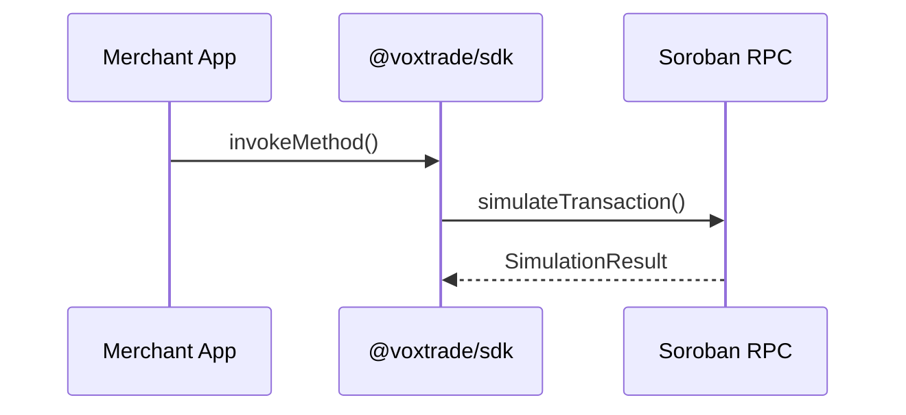

## 1. Summary & Objective
<!-- High-level executive summary of the complex feature, architectural rework, or cryptographic integration. -->

## 2. Context & Technical Rationale
<!-- Why is this critical to system security, reliability, or protocol integrity? Detail the interaction between Next.js, @voxtrade/sdk, Soroban RPC, and the smart contracts. -->

## 3. Scope & Target Files
<!-- Specify affected modules, contracts, or SDK files. -->
- `packages/sdk/src/...`
- `apps/web/src/...`

## 4. Current State vs. Desired State
- **Current Behavior**: <!-- What are the existing limitations or architectural constraints? -->
- **Desired Behavior**: <!-- What is the exact expected outcome, cryptographic flow, or state transition? -->

## 5. Technical Specification & Transaction Flow
<!-- Detailed breakdown of RPC calls, XDR payloads, preimage hashing, or authorization bounds. -->


### Key Interfaces & Types
```typescript
// Define interfaces, method signatures, or data structures
```

## 6. Security, Invariant & Error Handling Requirements
- [ ] Safe simulation and fee budgeting prior to transaction submission.
- [ ] Comprehensive handling of edge cases (RPC timeout, transaction rejection, invalid preimages, expired ledgers).
- [ ] Strict TypeScript typing with zero `any` allocations.

## 7. Acceptance Criteria
- [ ] End-to-end functionality verified against live Stellar Testnet RPC.
- [ ] Comprehensive unit and integration test suite covering positive, negative, and edge-case execution paths.
- [ ] Quality gates passing:
  - [ ] `pnpm --filter @voxtrade/sdk build`
  - [ ] `pnpm lint` (0 errors)
  - [ ] `pnpm typecheck` (0 errors)
  - [ ] `pnpm test` (all tests pass)
  - [ ] `pnpm build` (production build succeeds)

## 8. Implementation Guide & References
<!-- Helpful links to Soroban documentation, Stellar SDK references, or existing codebase patterns. -->
