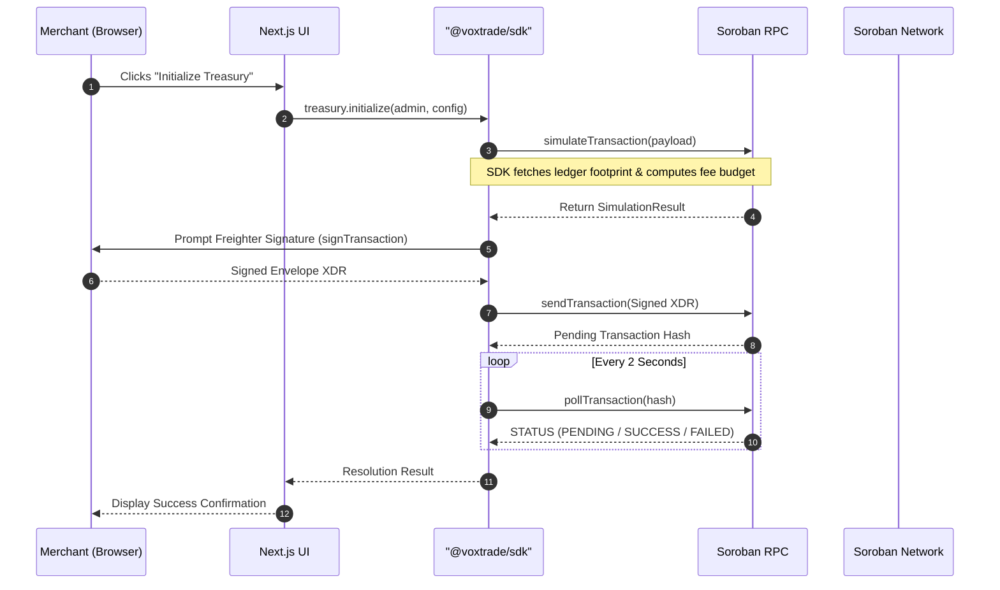

<div align="center">
  <h1>voxtrade-app</h1>
  <p><strong>Sovereign Voice-to-Voice Commerce: Merchant Dashboard &amp; TypeScript SDK</strong></p>
  <p>
    <a href="https://github.com/voxxtrade/voxtrade-app/actions/workflows/ci.yml"></a>
    <a href="https://voxtrade-rho.vercel.app"></a>
    <a href="https://voxxtrade.github.io/docs/"></a>
    
    
    
  </p>
  <p>
    <a href="https://voxtrade-rho.vercel.app"><strong>Live Web App</strong></a> &bull;
    <a href="https://voxxtrade.github.io/docs/"><strong>Docs Portal</strong></a> &bull;
    <a href="https://github.com/voxxtrade/voxtrade-contract"><strong>VoxTrade Contracts</strong></a> &bull;
    <a href="#what-is-voxtrade-app"><strong>What is this Repo?</strong></a> &bull;
    <a href="#published-stellar-testnet-contracts"><strong>Published Contracts</strong></a> &bull;
    <a href="#stellar-ecosystem-integration"><strong>Stellar Integration</strong></a> &bull;
    <a href="#architectural-rationale-why-two-smart-contracts"><strong>Why 2 Contracts?</strong></a> &bull;
    <a href="#getting-started"><strong>Getting Started</strong></a> &bull;
    <a href="#system-architecture--rpc-flow"><strong>Architecture</strong></a> &bull;
    <a href="#sdk-integration"><strong>SDK Integration</strong></a>
  </p>
</div>

---

## What is `voxtrade-app`?

**`voxtrade-app`** is the **full-stack application and developer SDK repository** for the [VoxTrade](https://github.com/voxxtrade) protocol. It provides the off-chain merchant command center, TypeScript client libraries, and real-time voice streaming pipelines that connect human traders, autonomous AI agents, and Stellar Soroban smart contracts.

This monorepo contains:

1. **[`@voxtrade/sdk`](packages/sdk)** (`packages/sdk`): A TypeScript/JavaScript client library providing type-safe bindings for Soroban smart contracts (`AgentTreasury` & `X402Escrow`), network constants (`STELLAR_NETWORKS`, RPC endpoints), cryptographic preimage utilities (`SHA-256`), and Web Audio stream pipelines for voice processing.
2. **[Merchant Web Dashboard & Voice Room](apps/web)** (`apps/web`): A Next.js 15 web application featuring:
   - **Freighter Wallet Authentication**: Non-custodial sign-in via `@stellar/freighter-api`.
   - **Treasury Control Center**: Real-time 24-hour spending budget allocation, balance monitoring, and key rotation.
   - **3-Mode Voice Negotiation Room**: Live Voice-to-Voice AI negotiation powered by Gemini Live audio streaming, acoustic testbench telemetry, and manual simulation.
   - **X402 Settlement Inspector**: Visual tracking of HTTP 402 challenge-response escrows and Stellar Expert explorer integration.
3. **HTTP 402 API Endpoints**: Serverless Next.js route handlers implementing machine-to-machine HTTP 402 payment negotiation handshakes (`/api/x402` and `/api/negotiate`).

> ⛓️ **Looking for the Smart Contracts?** Visit **[`voxxtrade/voxtrade-contract`](https://github.com/voxxtrade/voxtrade-contract)** for the Soroban Rust contracts (`AgentTreasury.wasm` and `X402Escrow.wasm`).  
> 🚀 **Live Web Application**: **[`https://voxtrade-rho.vercel.app`](https://voxtrade-rho.vercel.app)**  
> 📖 **Official Documentation**: **[`https://voxxtrade.github.io/docs/`](https://voxxtrade.github.io/docs/)**


---

## Published Stellar Testnet Contracts

The VoxTrade core contracts are deployed on the **Stellar Testnet**:

| Contract | Testnet Contract ID | Explorer |
|---|---|---|
| **`AgentTreasury`** | `CCBZLHEHRUBAHGB72ZZLNHBT4RURGTW2SSSQC4DJDDILVDG4VR55FEJL` | [View on Stellar Expert](https://stellar.expert/explorer/testnet/contract/CCBZLHEHRUBAHGB72ZZLNHBT4RURGTW2SSSQC4DJDDILVDG4VR55FEJL) |
| **`X402Escrow`** | `CDJS3VHPBXVSFIPA6FUBVS3YXKUGZ75GQ7TQFVPMHBX3KHMREGGNMLFE` | [View on Stellar Expert](https://stellar.expert/explorer/testnet/contract/CDJS3VHPBXVSFIPA6FUBVS3YXKUGZ75GQ7TQFVPMHBX3KHMREGGNMLFE) |

- **Network**: Stellar Testnet (`Test SDF Network ; September 2015`)
- **Soroban RPC**: `https://soroban-testnet.stellar.org`
- **USDC Asset**: `CCW67TSZV3SSS2HXMBQ5JFGCKJNXKZM7UQUWUZPUTHXSTZLEO7SJMI75`

---

## Stellar Ecosystem Integration

`voxtrade-app` provides the off-chain merchant command center and TypeScript client layer directly connected to the Stellar and Soroban network:

| Stellar Technology | Integration & Role in `voxtrade-app` |
| :--- | :--- |
| **Freighter Wallet Extension** | Non-custodial authentication via `@stellar/freighter-api`. Merchants sign `AgentTreasury` deployment, parameter configuration, key rotation, and balance withdrawal envelopes directly from the browser. |
| **Stellar Asset Contract (SAC / SEP-0041)** | Manages enterprise stablecoin custody (e.g. Testnet USDC `CCW6...MI75`). The `@voxtrade/sdk` interfaces with SAC token contracts for trustless balance verification and escrow locks. |
| **Soroban RPC Infrastructure** | High-throughput interaction with `https://soroban-testnet.stellar.org`. Automatically handles footprint resolution, fee budget calculation, transaction simulation, and asynchronous ledger polling. |
| **Atomic Cross-Contract Execution** | Orchestrates calls where the user's `AgentTreasury` contract transfers SAC tokens and registers escrow records on `X402Escrow` within an atomic ledger sequence. |
| **IETF HTTP 402 + Stellar Alignment** | Bridges Web2 HTTP streaming status codes (`402 Payment Required`) with Stellar Soroban HTLC escrows, creating an automated micropayment loop for real-time voice synthesis. |

---

## Architectural Rationale: Why Two Smart Contracts?

VoxTrade intentionally deploys **exactly two focused smart contracts** (`AgentTreasury` and `X402Escrow`) to adhere to core smart account and distributed system principles:

1. **Separation of Policy Vault vs. Market Settlement (Least Privilege)**:
   - **`AgentTreasury` is an Account Abstraction Vault**: Represents the merchant's account. It strictly enforces security policies: 24-hour spending caps, delegated AI agent keys, and admin withdrawal authority.
   - **`X402Escrow` is an Atomic Market Settlement Engine**: Holds tokens in trustless HTLC custody until a cryptographic SHA-256 preimage is revealed or a timeout ledger sequence is reached.
   - **Security Isolation**: If market settlement and treasury custody were combined, an exploit in deal negotiation or counterparty dispute could drain the merchant's vault. Decoupling them ensures an adversarial counterparty can never access treasury collateral outside of explicitly locked escrows.

2. **Multi-Tenant Settlement vs. Dedicated Merchant Vaults**:
   - `X402Escrow` is deployed once as a shared, stateless multi-tenant utility for the entire Stellar ecosystem.
   - `AgentTreasury` is instantiated per merchant or enterprise to manage individual signing delegation and risk parameters.

3. **Reusing Native Stellar Primitives**:
   - **No Custom Token Contract**: Uses Stellar's native Stellar Asset Contract (SAC) for USDC and XLM instead of introducing proprietary token contracts.
   - **No Custom DEX / Swap Contract**: Directly leverages Stellar's built-in orderbooks and liquidity pools when conversion is required.
   - **Off-Chain Audio Transport**: Audio streams travel peer-to-peer via WebRTC and HTTP 402; only 32-byte cryptographic hashes and payment proofs touch the Soroban ledger, keeping state rent and execution latency at absolute minimums.

---

## Overview

While the [voxtrade-contract](https://github.com/voxxtrade/voxtrade-contract) repository enforces rigid security limits and cryptographic bounds on-chain, `voxtrade-app` provides the critical off-chain interface required to interact with the system securely.

This repository is built as a strict `pnpm` monorepo containing two core layers:
1. **The Merchant Dashboard (`apps/web`)** &mdash; A highly optimized, responsive Next.js 14 web application. This is the command center where human merchants connect their Freighter wallets, deploy new `AgentTreasury` contracts, and configure strict 24-hour spending bounds for their AI agents.
2. **The VoxTrade SDK (`packages/sdk`)** &mdash; A robust, strongly-typed TypeScript library. It abstracts the complexities of XDR encoding, transaction simulation, and asynchronous RPC polling, providing a clean programmatic API to the VoxTrade Soroban contracts.

---

## System Architecture & RPC Flow

VoxTrade utilizes a highly explicit transaction lifecycle to ensure safety and transparency when interacting with the Stellar network. The SDK manages footprint generation and transaction simulation automatically before prompting the user for a cryptographic signature.



---

## Monorepo Structure

```text
voxtrade-app/
├── packages/
│   └── sdk/                       # Core TypeScript SDK (see packages/sdk/README.md)
│       ├── src/
│       │   ├── treasury.ts        # AgentTreasury contract bindings
│       │   ├── escrow.ts          # X402Escrow contract bindings
│       │   ├── voice.ts           # Voice synthesis ranking & dialogue sanitizer
│       │   ├── x402.ts            # HTTP 402 challenge parser & preimage generator
│       │   └── index.ts           # Public isomorphic exports
│       ├── package.json
│       ├── README.md              # Detailed SDK documentation & examples
│       └── tsconfig.json          # Strict TS compilation settings
└── apps/
    └── web/                       # Merchant Dashboard (see apps/web/README.md)
        ├── src/
        │   ├── app/
        │   │   ├── page.tsx       # Landing & Voice Negotiation Room
        │   │   ├── dashboard/     # Treasury configuration & limits UI
        │   │   └── api/negotiate/ # AI negotiation & LLM provider route
        │   ├── components/
        │   │   ├── VoiceNegotiationRoom.tsx # 3-mode acoustic negotiation
        │   │   ├── TreasuryManager.tsx      # Rolling 24H vault manager
        │   │   ├── EscrowMonitor.tsx        # Real-time Soroban HTLC telemetry
        │   │   └── FreighterConnect.tsx     # Stellar wallet integration
        │   └── lib/
        │       └── stellar.ts     # Network & RPC configurations
        ├── package.json
        ├── README.md              # Web console guide & Vercel deployment
        ├── tailwind.config.ts
        └── next.config.mjs
```

---

## SDK Integration

The `@voxtrade/sdk` is designed to be fully isomorphic, meaning it can be used both in browser environments (hooked into Freighter) and in Node.js backend environments (hooked into server-side keypairs for automated AI agent operations). See **[`packages/sdk/README.md`](packages/sdk/README.md)** for complete API reference.

### Initializing the Treasury

```typescript
import { AgentTreasury } from '@voxtrade/sdk';

// 1. Instantiate the Treasury SDK
const treasury = new AgentTreasury(
  process.env.NEXT_PUBLIC_TREASURY_WASM_HASH || 'b9a38f712c4d9e018274ac4839201f84b9c1d0ef93847291a0c8b74619372ef4',
  'https://soroban-testnet.stellar.org',
  'Test SDF Network ; September 2015'
);

// 2. Define strict bounds for the AI Agent
const config = {
  dailyLimit: 100_000_000n, // 10 USDC (7 decimals)
  agent: 'GBZXN7PIRZGNMHGA72ST2EQTVGQDXF45NWZ46CXCW462KC22W6KZNVLB',
  escrowContract: 'CDJS3VHPBXVSFIPA6FUBVS3YXKUGZ75GQ7TQFVPMHBX3KHMREGGNMLFE'
};

// 3. Execute (Handles Simulation, Freighter Signature, and Polling)
const txResult = await treasury.initialize('G_MERCHANT_ADMIN_KEY...', config);
console.log('Treasury Deployed:', txResult.hash);
```

### Locking & Claiming an Escrow (HTLC Flow)

```typescript
import { X402Escrow, generatePreimage } from '@voxtrade/sdk';

const escrow = new X402Escrow(
  process.env.NEXT_PUBLIC_ESCROW_CONTRACT_ID || 'CDJS3VHPBXVSFIPA6FUBVS3YXKUGZ75GQ7TQFVPMHBX3KHMREGGNMLFE',
  'https://soroban-testnet.stellar.org',
  'Test SDF Network ; September 2015'
);

// 1. Generate cryptographic hashlock: H = SHA256(preimage)
const { preimage, hashLockHex } = generatePreimage();

// 2. Lock funds in Soroban escrow (Buyer flow)
const lockResult = await escrow.lockFunds(
  'G_BUYER_PUBLIC_KEY...',
  'G_SUPPLIER_PUBLIC_KEY...',
  'CCW67TSZV3SSS2HXMBQ5JFGCKJNXKZM7UQUWUZPUTHXSTZLEO7SJMI75', // USDC
  70_000_000n, // 7.00 USDC
  hashLockHex,
  120 // Timeout in ledgers (~10 minutes)
);

// 3. Claim funds with revealed preimage (Supplier flow)
await escrow.claim('G_SUPPLIER_PUBLIC_KEY...', lockResult.escrowId, preimage);
```

---

## Getting Started

### Prerequisites

- **Node.js**: `v18.0.0` or higher
- **Package Manager**: `pnpm` (`npm install -g pnpm`)
- **Wallet**: The [Freighter](https://www.freighter.app/) browser extension.

### 1. Installation

Clone the repository and install all workspace dependencies:

```bash
git clone https://github.com/voxxtrade/voxtrade-app.git
cd voxtrade-app

pnpm install
```

### 2. Environment Configuration

The dashboard requires network and contract variables to function. Copy the example environment file:

```bash
cd apps/web
cp .env.example .env.local
```

| Variable | Description | Example |
|---|---|---|
| `NEXT_PUBLIC_STELLAR_NETWORK` | The target Stellar network | `testnet` or `mainnet` |
| `NEXT_PUBLIC_SOROBAN_RPC_URL` | The Soroban RPC endpoint | `https://soroban-testnet.stellar.org` |
| `NEXT_PUBLIC_TREASURY_WASM_HASH` | The deployed WASM hash for the Treasury | `4d3c...` |
| `NEXT_PUBLIC_ESCROW_CONTRACT_ID` | The deployed X402 Escrow Contract ID | `C...` |
| `NEXT_PUBLIC_USDC_CONTRACT_ID` | The Native Stellar Asset wrapper for USDC | `C...` |

### 3. Local Development

Start the Next.js development server:

```bash
pnpm dev
```

The Merchant Dashboard will be accessible at [http://localhost:3000](http://localhost:3000).

---

## Security & Audits

VoxTrade is currently in active development. The smart contracts and off-chain SDKs have **not yet undergone formal security audits**. Please refer to our [SECURITY.md](SECURITY.md) for our responsible disclosure policy and supported versions.

## Contributing

We welcome contributions from the ecosystem! Whether it's optimizing the SDK's XDR parsing, expanding test coverage, or refining the Next.js dashboard, please read our [CONTRIBUTING.md](CONTRIBUTING.md) to understand our workflow, branch protections, and PR requirements.

- 🧪 **Stellar Testnet Guide**: Review our **[Stellar Testnet Setup Guide](docs/testnet-setup.md)** to configure your Freighter wallet, claim Friendbot lumens, and set up USDC trustlines.
- 🤝 **Community Standards**: Contributions are governed by our **[Code of Conduct](CODE_OF_CONDUCT.md)**.

## Contributors

Thanks to all the incredible people who contribute to VoxTrade!

<a href="https://github.com/voxxtrade/voxtrade-app/graphs/contributors">
  
</a>

Contributions of any kind are welcome! Please check out our [CONTRIBUTING.md](CONTRIBUTING.md) to get started.

## License

Released under the [MIT License](LICENSE).


